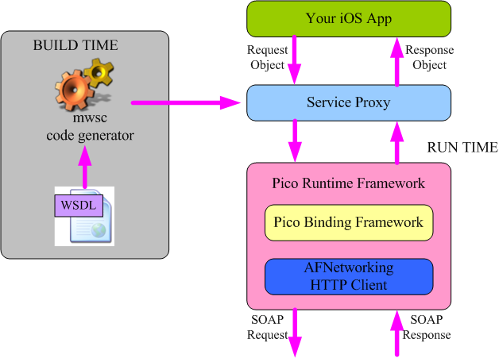

# PicoKit

[](https://travis-ci.org/maxep/PicoKit)
[](http://cocoadocs.org/docsets/PicoKit)
[](http://cocoadocs.org/docsets/PicoKit)
[](http://cocoadocs.org/docsets/PicoKit)

A light Web Service client framework targeting iOS platform.

##_Note_
_[Pico](https://github.com/bulldog2011/pico) (and related projects: [mxjc](https://github.com/maxep/mxjc), [mwsc](https://github.com/maxep/mwsc) & [nano](https://github.com/maxep/nano)) has been developed by [bulldog2011](http://bulldog2011.github.com) but stayed as is from 2013. As it is very well designed and implemented, I decided to fork it and upgrade it to support ARC and be available through [CocoaPods](https://cocoapods.org/)._

## Feature Highlight

1. Support WSDL driven development, [code generator](https://github.com/maxep/mwsc) tool is provided to auto-genearte strongly typed proxy from WSDL. 
2. Support SOAP 1.1/1.2 and XML based web service. 
3. Support automatic SOAP/XML to Objective-C object binding, performance is better than iOS native XML parser.
4. Built on popular and mature [AFNetworking](https://github.com/AFNetworking/AFNetworking) library for iOS.
5. Has been verified with industrial level Web Service like Amazon ECommerce Web Serivce and eBay Finding/Shopping/Trading Web Service. 
6. Support asychronous service invocation, flexible HTTP/SOAP header setting, timeout setting, encoding setting, logging, etc.

## The Big Picture


## Installation

PicoKit is available through [CocoaPods](http://cocoapods.org). To install
it, simply add the following line to your Podfile:

```
pod 'PicoKit', :git => 'https://github.com/maxep/PicoKit.git'
````

#### Old fashioned way:
Include the whole Pico source in your project. If you use this option, make sure:

1. In Target Build Setting, add the `-ObjC` flag to your "Other Linker flags".
2. In Target Build Setting, add `/usr/include/libxml2` to your "Header Search Paths"
3. In Target Build Phases, link binary with library `libxml2.dylib`

## WSDL Driven Development Flow
1. Generate Objective-C proxy from WSDL
2. Create new iOS project, add PicoKit and generated proxy into your project
4. Implement appliction logic and UI, call proxy to invoke web service as needed.

## Example Usage
After the service proxy is generated from wsdl, service invocation through Pico runtime is extremely easy:

``` objective-c

        // start progress activity
        [self.view makeToastActivity];
        
        // Get shared service client
        StockQuoteServiceClient *client = [StockQuoteServiceClient sharedClient];
        client.debug = YES; // enable request/response message logging
        
        // Build request object
        GetQuote *request = [[[GetQuote alloc] init] autorelease];
        request.symbol = _symbolText.text;
        
        // make API call and register callbacks
        [client getQuote:request success:^(GetQuoteResponse *responseObject) {
            
            // stop progress activity
            [self.view hideToastActivity];
            
            // show result
            _resultText.text = responseObject.getQuoteResult;
        } failure:^(NSError *error, id<PicoBindable> soapFault) {
            
            // stop progress activity
            [self.view hideToastActivity];
            
            if (error) { // http or parsing error
                [self.view makeToast:[error localizedDescription] duration:3.0 position:@"center" title:@"Error"];
            } else if (soapFault) {
                SOAP11Fault *soap11Fault = (SOAP11Fault *)soapFault;
                [self.view makeToast:soap11Fault.faultstring duration:3.0 position:@"center" title:@"SOAP Fault"];
            }
        }];
```

## Sample List
All samples are in the [Examples](https://github.com/maxep/PicoKit/master/Examples) folder, following samples are included:

* StockQuote - Demo app using [StockQueue](http://www.webservicex.net/ws/WSDetails.aspx?CATID=2&WSID=9) SOAP web serivce from webserviceX.NET.
* CurrencyConverter - Demo app using [CurrencyConverter](http://www.webservicex.net/ws/WSDetails.aspx?CATID=2&WSID=10) SOAP web service from webserviceX.NET.
* BarCode - Demo app using [BarcodeGenerator](http://www.webservicex.net/ws/WSDetails.aspx?CATID=8&WSID=76) SOAP web serivce from webserviceX.NET
* Weather - Demo app using [Weather](http://wsf.cdyne.com/WeatherWS/Weather.asmx) SOAP web serivce from wsf.cdyne.com
* eBayFinding - Hello world like sample using [eBay Finding API](https://www.x.com/developers/ebay/products/finding-api) SOAP call.
* eBayShopping - Hello world like sample using [eBay Shopping API](https://www.x.com/developers/ebay/products/shopping-api) XML call.
* AWSECommerce - Hello world like sample using [Amazon Product Advertising API](https://affiliate-program.amazon.com/gp/advertising/api/detail/main.html) SOAP call.
* eBayDemoApp - Sample eBay Search App using both eBay Finding API and eBay Shopping API.
* AWSECDemoApp - Sample Amazon Book search and purchase app using Amazon Product Advertising API.

## Documentation
1. [Wsdl Driven Development on iOS - the Big Picture](http://bulldog2011.github.com/blog/2013/03/25/wsdl-driven-development-on-ios-the-big-picture/)
2. [Pico Tutorial 1 - A StockQuote Sample](http://bulldog2011.github.com/blog/2013/03/27/pico-tutorial-a-stockquote-sample/)
3. [Pico Tutorial 2 - A CurrencyConverter Sample](http://bulldog2011.github.com/blog/2013/03/28/pico-tutorial-2-a-currency-converter-sample/)
4. [Pico Tutorial 3 - Hello eBay Finding Service](http://bulldog2011.github.com/blog/2013/03/29/pico-tutorial-3-hello-ebay-finding/)
5. [Pico Tutorial 4 - Hello eBay Shopping Service](http://bulldog2011.github.com/blog/2013/03/30/pico-tutorial-4-hello-ebay-shopping/)
6. [Pico Tutoiral 5 - Hello Amazon Product Advertising API](http://bulldog2011.github.com/blog/2013/03/31/pico-tutoiral-5-hello-amazon-product-advertising-api/)
7. [Pico and eBay Trading API integration How To](http://bulldog2011.github.com/blog/2013/04/01/pico-and-ebay-trading-api-integration-how-to/)
8. [Easy Web Service on iOS with Pico[ppt]](http://www.slideshare.net/yang75108/easy-web-serivce-on-ios-with-pico)

## Mapping between XML Schema Types and Objective-C Types 

|       XML Schema Data Types   |       Objective-C Data Types  |
|-------------------------------|-------------------------------|
|       xsd:base64Binary        |       NSData                  |
|       xsd:boolean             |       NSNumber                |
|       xsd:byte                |       NSNumber                |
|       xsd:date                |       NSDate                  |
|       xsd:dateTime            |       NSDate                  |
|       xsd:decimal             |       NSNumber                |
|       xsd:double              |       NSNumber                |
|       xsd:duration            |       NSString                |
|       xsd:float               |       NSNumber                |
|       xsd:g                   |       NSDate                  |
|       xsd:hexBinary           |       NSData                  |
|       xsd:int                 |       NSNumber                |
|       xsd:integer             |       NSNumber                |
|       xsd:long                |       NSNumber                |
|       xsd:NOTATION            |       NSString                |
|       xsd:Qname               |       NSString                |
|       xsd:short               |       NSNumber                |
|       xsd:string              |       NSString                |
|       xsd:time                |       NSDate                  |
|       xsd:unsignedByte	|       NSNumber                |
|       xsd:unsignedInt         |       NSNumber                |
|       xsd:unsignedShort       |       NSNumber                |

## Version History

|       Version         |       Date            |       Description     |
|-----------------------|-----------------------|-----------------------|
|[0.5.0](https://github.com/bulldog2011/pico/releases/tag/v0.5.0)|March 25, 2013  |Initial version|

## Current Limitation
1. Only Document/Literal style Web Service is support, RPC style Web Serivice is not supported.
2. SOAP attachment is not supported

## Related project
1. [Pico proxy for Amazon Product Advertising API](https://github.com/bulldog2011/PicoAWSECommerceServiceClient)
2. [Pico proxy for eBay Finding API](https://github.com/bulldog2011/PicoEBayFindingClient)
3. [Pico proxy for eBay Shopping API](https://github.com/bulldog2011/PicoEBayShoppingClient)
4. [Pico proxy for eBay Trading API](https://github.com/bulldog2011/PicoEBayTradingClient)

## License

PicoKit is available under the MIT license. See the [LICENSE](LICENSE) file for more info. 
